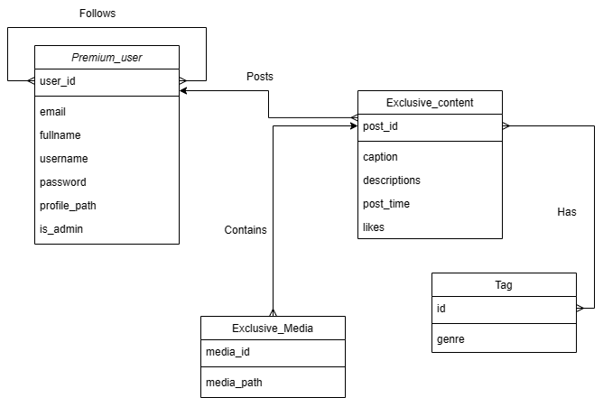

# ForPin-REST

> Disusun untuk memenuhi Tugas Milestone 2 IF3110 -  Web Services using SOAP and REST

# ForPin

> Disusun untuk memenuhi Tugas Milestone 1 IF3110 - Monolithic PHP & Vanilla Web Application

## Daftar Isi

-   [Deskripsi Aplikasi Web](#deskripsi-aplikasi-web)
-   [Skema Basis Data](#skema-basis-data)
-   [Endpoint API](#endpoint-api)
-   [Pembagian Tugas](#pembagian-tugas)

## Deskripsi Aplikasi Web

ForPin REST Service merupakan Web Service berbasis REST protocol yang menyediakan layanan untuk memakai premium feature ForPin. Web Service ini dibangun dengan menggunakan NodeJS, menggunakan PostgreSQL untuk basis data, dan docker sebagai containernya.

## Skema Basis Data

## Endpoint API
- http://localhost:3000/user        
- http://localhost:3000/user/getSearch        
- http://localhost:3000/user/login          
- http://localhost:3000/exclusiveContent    
- http://localhost:3000/exclusiveContent/contentdetails   
- http://localhost:3000/media               
- http://localhost:3000/subscription        
- http://localhost:3000/tags     
- http://localhost:3000/premium

## Pembagian Tugas

| Fitur                             | NIM                           |
| --------------------------------- | ----------------------------- |
| Routing                           | 13521069, 13521156            |
| Controllers                       | 13521069, 13521156            |
| Models                            | 13521069, 13521156            |
| Database Schema                   | 13521156                      |